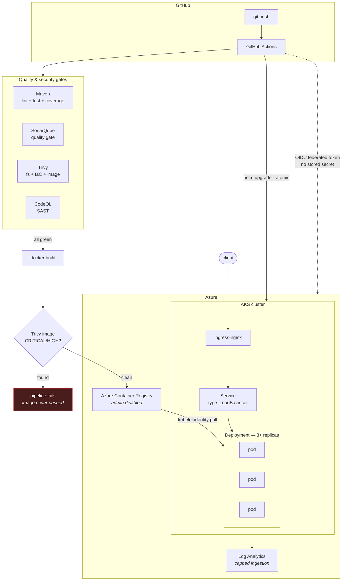
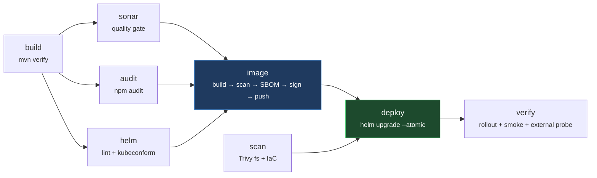

# orders-api — Node.js DevSecOps pipeline on Azure Kubernetes Service

[](https://github.com/Sanjay-Naidu/project4-node_js-cicd-sonar-trivy-acr-aks-helm/actions/workflows/ci.yml)
[](https://github.com/Sanjay-Naidu/project4-node_js-cicd-sonar-trivy-acr-aks-helm/actions/workflows/codeql.yml)
[](https://github.com/Sanjay-Naidu/project4-node_js-cicd-sonar-trivy-acr-aks-helm/actions/workflows/infra.yml)
[](LICENSE)


A production-shaped delivery pipeline for a Node.js REST API: **Maven → SonarQube → Trivy → ACR → AKS**, wired end to end with GitHub Actions, Terraform and Helm. Every credential is federated (OIDC) — there is not a single stored secret in the repository or in Azure.

> Built as a portfolio piece by **[Sanjay Naidu](https://github.com/Sanjay-Naidu)**. The application itself is deliberately small; the point is everything around it — the gates, the rollout mechanics, the identity model and the teardown story.

```bash
git clone https://github.com/Sanjay-Naidu/project4-node_js-cicd-sonar-trivy-acr-aks-helm.git
```

---

## What this demonstrates

| Area | What is actually implemented |
|---|---|
| **Build** | Maven drives the Node lifecycle via `frontend-maven-plugin` — `mvn verify` provisions Node, runs `npm ci`, ESLint and Jest with coverage |
| **Code quality** | SonarQube/SonarCloud with `-Dsonar.qualitygate.wait=true`, so a failing gate fails the pipeline |
| **Supply chain** | Trivy filesystem, IaC and **blocking** image scan; CodeQL dataflow analysis; npm audit; CycloneDX SBOM; keyless cosign signing |
| **Registry** | ACR with the admin account disabled — push via OIDC, pull via the kubelet's managed identity |
| **Infrastructure** | Terraform: AKS, ACR, VNet + NSG, Log Analytics, RBAC. Remote state in Azure Storage with Entra ID auth (no storage keys) |
| **Deployment** | Helm chart with rolling update `maxUnavailable: 0`, three-probe health model, HPA, PDB, NetworkPolicy, LoadBalancer Service + NGINX ingress |
| **Identity** | GitHub OIDC → Entra ID federated credentials. Zero client secrets, zero `AZURE_CREDENTIALS` JSON blob |
| **Operations** | Automatic rollback (`helm --atomic`), post-deploy smoke tests, failure diagnostics capture, one-click teardown |

---

## Architecture



### Pipeline stages



---

## Repository layout

```
├── app/                        Node.js service
│   ├── src/
│   │   ├── index.js            entrypoint: boot + graceful shutdown
│   │   ├── app.js              Express wiring
│   │   ├── lifecycle.js        the startup/ready/live state machine
│   │   ├── config.js           validated, fail-fast env config
│   │   ├── metrics.js          Prometheus instrumentation
│   │   ├── routes/             health probes + orders API
│   │   ├── middleware/         correlation ids, error handling
│   │   └── store/              repository (in-memory)
│   ├── tests/                  Jest suites incl. drain behaviour
│   ├── pom.xml                 Maven wrapper around the npm lifecycle
│   └── Dockerfile              multi-stage, non-root, read-only rootfs
│
├── deploy/helm/orders-api/     Helm chart
│   ├── values.yaml             heavily commented defaults
│   ├── values-dev.yaml         trial-subscription sizing
│   ├── values-prod.yaml        the prod delta, for comparison
│   └── templates/              deployment, svc, ingress, hpa, pdb, netpol
│
├── infra/terraform/            AKS + ACR + networking + RBAC
│   ├── environments/           dev.tfvars / prod.tfvars
│   └── backend.tf              partial config — state location never committed
│
├── .github/workflows/
│   ├── ci.yml                  build → gates → image → deploy
│   ├── cd.yml                  reusable Helm deployment
│   ├── infra.yml               terraform plan (PR) / apply (dispatch)
│   ├── infra-destroy.yml       guarded teardown
│   ├── platform.yml            ingress-nginx + cert-manager bootstrap
│   ├── bootstrap-lockfile.yml  one-time package-lock.json generation
│   └── codeql.yml              SAST
│
├── scripts/                    OIDC setup, zero-downtime verification
└── docs/                       setup, architecture, runbook, cost
```

---

## Getting started

Full walkthrough: **[docs/AZURE-SETUP.md](docs/AZURE-SETUP.md)**. The short version:

### 1. Things you create by hand

```bash
az group create -n rg-ordersapi-dev -l eastus

az storage account create -n st<unique>tfstate -g rg-ordersapi-dev \
  -l eastus --sku Standard_LRS --min-tls-version TLS1_2 \
  --allow-blob-public-access false
az storage container create -n tfstate --account-name st<unique>tfstate --auth-mode login

az ad app create --display-name gh-ordersapi-oidc
```

### 2. Wire up OIDC

```powershell
./scripts/azure-oidc-setup.ps1 `
  -AppClientId "<APP_CLIENT_ID>" `
  -GitHubRepo "<owner>/<repo>" `
  -ResourceGroup "rg-ordersapi-dev" `
  -StateStorageAccount "st<unique>tfstate" `
  -SetGitHubVariables
```

Creates the federated credentials, assigns the roles, and prints the repository variables to set. A bash equivalent is in the same directory.

### 3. Run the workflows, in order

| # | Workflow | Purpose |
|---|---|---|
| 1 | **Infrastructure** → `apply` | creates AKS, ACR, VNet, Log Analytics; prints the remaining repo variables |
| 2 | *(set `ACR_NAME`, `ACR_LOGIN_SERVER`, `AKS_CLUSTER_NAME`)* | |
| 3 | **Platform bootstrap** | installs ingress-nginx and reports its public IP |
| 4 | **CI** *(or push to `main`)* | builds, gates, pushes, deploys |

`app/package-lock.json` is already committed, so `npm ci` works from the first run. The **Bootstrap lockfile** workflow is only needed if you ever want to regenerate it without Node installed locally.

Then:

```bash
curl http://<ingress-ip>/healthz
curl http://<ingress-ip>/api/v1/orders
```

### 4. Tear it down

Run **Infrastructure destroy** and type `DESTROY`. On a trial credit this matters — see [docs/COST.md](docs/COST.md).

---

## Local development

No Azure account needed for any of this:

```bash
make install        # npm install (creates the lockfile)
make test           # Jest
make verify         # the exact Maven build CI runs
make docker-build   # the exact image CI builds
make helm-lint      # lint both value overlays
make tf-validate    # validate Terraform without a backend
make ci-local       # every gate that does not require Azure
```

---

## Engineering decisions worth reading

Each of these is a place where the obvious choice is subtly wrong. Full reasoning in [docs/ARCHITECTURE.md](docs/ARCHITECTURE.md).

**Three probes, three different questions.** Liveness never checks dependencies — a liveness probe that fails during a database blip restarts every pod at once and converts a degradation into an outage. Startup gates the other two so liveness can stay tight without a long `initialDelaySeconds`.

**`maxUnavailable: 0` plus an application-level drain.** Kubernetes removes a pod from the Service and sends `SIGTERM` *concurrently*, so a process that exits promptly on `SIGTERM` drops in-flight requests. The app flips readiness to 503, keeps serving for a drain window, and only then closes the listener. `terminationGracePeriodSeconds` is set to exceed that window.

**No CPU limit, but a memory limit.** CFS throttling on a Node.js event loop produces latency spikes worse than the noisy-neighbour problem the limit would solve. Memory is incompressible, so that one is capped.

**Immutable image tags, enforced in the chart.** `image.tag` is the git SHA, and the Helm helper calls `fail` if it is empty or `latest`. A mutable tag makes rollback meaningless.

**The image is scanned before it is pushed.** Building with `load: true` and scanning the local daemon image means a vulnerable artefact never reaches the registry — as opposed to scanning after push, where the bad image is already available to pull.

**`local_account_disabled` + Azure RBAC on the cluster.** No static admin kubeconfig exists. Every `kubectl` call is an auditable Entra ID identity, which is what makes the RBAC assignments in `rbac.tf` meaningful rather than decorative.

**Terraform consumes the resource group as a data source.** It is created out of band, so `terraform destroy` removes the workload without touching the container it lives in — and the same code works on a locked-down subscription where you cannot create resource groups.

**The teardown workflow deletes LoadBalancer Services first.** Those Azure public IPs are created by Kubernetes, not Terraform, so they are not in state; destroying the VNet while they still reference it fails halfway through and leaves orphaned billing resources.

---

## Cost

Sized for a 30-day Azure free trial (~$159 credit). Roughly **$3/day**, dominated by the two `Standard_B2s` nodes.

| Component | Choice | Why |
|---|---|---|
| AKS control plane | Free tier | Standard tier is ~$73/mo for an SLA a demo does not need |
| Nodes | 2 × `Standard_B2s` | cheapest SKU AKS accepts for a system pool |
| ACR | Basic | Premium only buys private endpoints and geo-replication |
| Log Analytics | 0.2 GB/day cap | a crash-looping pod can otherwise ingest GBs in hours |

Breakdown and teardown checklist: [docs/COST.md](docs/COST.md).

---

## Documentation

| Document | Contents |
|---|---|
| [AZURE-SETUP.md](docs/AZURE-SETUP.md) | manual prerequisites, OIDC, every repository variable |
| [ARCHITECTURE.md](docs/ARCHITECTURE.md) | design decisions and the reasoning behind them |
| [RUNBOOK.md](docs/RUNBOOK.md) | rollback, debugging, scaling, proving zero-downtime |
| [COST.md](docs/COST.md) | cost model and teardown |
| [INTERVIEW-NOTES.md](docs/INTERVIEW-NOTES.md) | talking points and the questions this design invites |

---

## Licence

MIT — see [LICENSE](LICENSE).
