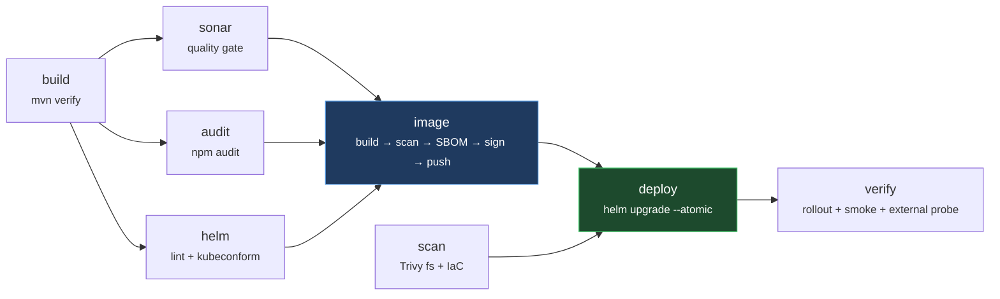

# Project 4 — Node.js App CI/CD on Azure AKS

**Author: Sanjay Naidu** · Platform Engineering portfolio project

End-to-end delivery pipeline for a Node.js (Express) REST API on Azure Kubernetes Service — built on a free-trial budget, and driven through **Maven** because plenty of real shops standardise on one build tool across a polyglot estate.

```
Node.js (Express) · Maven · Docker · Terraform · GitHub Actions (OIDC) · SonarCloud · Trivy · CodeQL · ACR · AKS · Helm
```


> Ran live on AKS at `20.237.23.1` (ingress) and `4.156.221.224` (LoadBalancer Service) before being torn down — the free-trial credit is the whole reason the destroy workflow exists. Everything is reproducible from this repo in about 15 minutes.

---

## Architecture


**Pipeline flow on every merge to `main`:**



---

## Why each decision (the part interviewers ask about)

### Application

| Decision | Why |
|---|---|
| **Express, small domain** | The app isn't the point. Keeping it small means every line of the pipeline stays readable. |
| **Three probes, not two** | Startup, readiness and liveness answer different questions. A liveness probe that checks a dependency restarts every pod at once when that dependency wobbles — a degradation becomes an outage. |
| **Startup probe gates the others** | Without it, liveness needs an `initialDelaySeconds` covering worst-case boot, and that delay then applies for the pod's whole life. |
| **Drain window on `SIGTERM`** | Endpoint removal and `SIGTERM` happen in parallel, with no ordering guarantee. Readiness flips to 503, the app keeps serving 8s, *then* stops listening. This is what makes the rollout genuinely zero-downtime. |
| **Metrics labelled by route, not URL** | `/orders/:id` is one time series. Labelling raw URLs mints one per order id and takes Prometheus down. There's a test asserting the id never appears in `/metrics`. |
| **Config validated at boot** | A bad env var kills the process with a message naming the variable, instead of a confusing 500 an hour later. |

### Build (Maven for a JavaScript app)

| Decision | Why |
|---|---|
| **`frontend-maven-plugin`** | Maven doesn't build JS. The plugin provisions a project-local Node toolchain and binds npm scripts to Maven phases, so `mvn verify` really does run `npm ci` → ESLint → Jest. Only a JDK is needed on the agent. |
| **Honest trade-off** | Greenfield with no constraint, I'd use npm directly with `sonar-scanner-cli`. This pattern earns its keep where one build tool spans every language. |
| **`npm ci`, never `npm install`** | Fails loudly when the lockfile and `package.json` have drifted, instead of quietly resolving versions nobody reviewed. |
| **Coverage floor 90/80/90/90** | A ratchet just under actual (97%), not an aspirational number everyone learns to bypass. |

### Containerisation

| Decision | Why |
|---|---|
| **Multi-stage build** | Dev dependencies and build cache never reach the published image. |
| **npm deleted from the runtime image** | Trivy blocked the build on 24 HIGH + 2 CRITICAL. Alpine was clean — every finding lived inside npm's own bundled deps (`sigstore`, `glob`, `minimatch`). The entrypoint is `node`; a package manager is dead weight. Removing it: **zero findings**. A guard fails the build if a base image sneaks it back. |
| **Non-root, read-only rootfs, all caps dropped** | Files stay root-owned while the process runs as `node`, so the container can't rewrite its own code. Only `/tmp` is writable. |
| **`--ignore-scripts` on install** | Cheapest defence against a compromised transitive package running install hooks. |

### Infrastructure (Terraform)

| Decision | Why |
|---|---|
| **Remote state, Entra ID auth** | `use_azuread_auth` with shared key access disabled — no storage key exists to leak, only a role assignment. |
| **Resource group as a `data` source** | Created out of band, so `destroy` removes the workload without touching the container it lives in — and the code works where you can't create resource groups. |
| **AKS Free tier** | $0 vs ~$73/month for an uptime SLA a demo doesn't need. |
| **`Standard_D2as_v7` nodes** | Same trap as Project 3: B-series isn't permitted on this subscription at all. `az vm list-usage` reports `Standard BS Family vCPUs: limit 4` while AKS rejects the create outright — **quota and SKU permission are different checks**. D2as_v7 is the cheapest permitted family, priced via the Retail Prices API. |
| **Regional quota of 4 vCPU drives the rest** | Two nodes is the ceiling, so the autoscaler is pinned min=max=2 and auto-upgrades are off (an upgrade surges a third node and would fail). Documented rather than left to break mysteriously. |
| **Azure CNI Overlay** | Pods draw from an overlay CIDR, so the `/24` node subnet never caps the cluster. |
| **`local_account_disabled` + Azure RBAC** | Kills the static cluster-admin kubeconfig. Every `kubectl` call is an auditable Entra ID identity. The cost: CI now needs `kubelogin`, and humans need an explicit role assignment. |
| **Log Analytics capped at 0.2 GB/day** | The likeliest way to lose a trial credit isn't the cluster — it's a crash-looping pod writing to stdout overnight at ~$2.76/GB. |
| **Explicit NSG rule for the LB data path** | AKS programs `Allow Internet` rules onto *its own* NSG and ignores a custom subnet NSG. Traffic must pass both, so a tidy `DenyAllInBound` silently blackholes every ingress and LoadBalancer Service while the cluster reports perfect health. Cost me a deploy to find. |

### CI/CD (GitHub Actions)

| Decision | Why |
|---|---|
| **OIDC federation, zero stored secrets** | No client secret exists anywhere. The detail that proves it's real: a job declaring `environment: dev` emits a *different* subject than a branch push, so it needs its own credential. GitHub also issues subjects in an immutable-id form (`owner@123/repo@456`) — mismatch there fails with `AADSTS700213`, so the setup script creates both shapes. |
| **`Contributor` is not enough for Terraform** | It explicitly can't create role assignments, and this stack creates four. The CI principal also needs `Role Based Access Control Administrator`, scoped to one resource group. |
| **Trivy scans the image *before* push** | Built with `load: true` and scanned in the local daemon, so a vulnerable image never reaches the registry — rather than scanning after push, when it's already pullable. |
| **Blocking vs advisory gates** | Image CVEs, secrets, tests, lint and the Sonar gate block. IaC misconfiguration is advisory, because findings like "ACR should have a private endpoint" are documented cost trade-offs, and blocking on those teaches people to bypass the scanner. |
| **Immutable `sha` tags, enforced in the chart** | The Helm helper calls `fail` if the tag is empty or `latest`. Catching it at template time is free; finding out at 3am that two pods run different code is not. |
| **`plan` and `apply` as separate jobs** | Not cosmetic: declaring `environment:` changes the OIDC subject, so one job doing both would need credentials for two shapes. |
| **`--atomic` + smoke test + external probe** | A failed rollout auto-reverts. `helm test` proves in-cluster routing; a curl against the public IP proves the whole path through the Azure LB. Those are different assertions — the second one is what caught the NSG bug. |
| **Teardown is a first-class workflow** | Guarded by a typed `DESTROY` confirmation. On a fixed credit, making teardown as easy as deployment *is* the cost control. |

### Helm chart (production traits)

- **`maxUnavailable: 0` with `maxSurge: 1`** → capacity never dips during a deploy; paired with the app's drain window, that's real zero-downtime.
- **`minReadySeconds: 10`** so a pod that passes one check then crashes can't let the rollout advance.
- **HPA (3→6)** and a **PodDisruptionBudget** using `maxUnavailable`, not `minAvailable` — the latter deadlocks node drains when the HPA sits at its floor.
- **Memory limit, no CPU limit.** CFS throttling on a single-threaded event loop hurts p99 more than the noisy-neighbour problem a limit would solve. Memory is incompressible, so that one is capped.
- **Config checksum annotation** → ConfigMap edits roll the pods automatically.
- **Hardened securityContext**: non-root, read-only root FS, all capabilities dropped, seccomp `RuntimeDefault`, `automountServiceAccountToken: false`.
- **NetworkPolicy** where egress does the real work: DNS and outbound 443 only, with `169.254.0.0/16` excluded to block the Instance Metadata Service — the standard container-escape-to-cloud-credentials path.

---

## Monthly cost picture (why this fits a free trial)

| Resource | Config | ~Cost/month |
|---|---|---|
| AKS control plane | Free tier | $0 |
| Node pool | 2 × Standard_D2as_v7 | ~$133 |
| OS disks | 2 × 64 GiB Standard SSD | ~$10 |
| Load balancer + 2 public IPs | Standard | ~$26 |
| ACR | Basic | ~$5 |
| Log Analytics | capped 0.2 GB/day | ~$17 |
| State storage | LRS, a few KB | <$1 |
| SonarCloud / GitHub Actions / Trivy | public repo | $0 |
| **Total (running 24×7)** | | **~$190** |

⚠️ **Cost note:** the plan assumed `Standard_B2s` (~$30/mo/node), but this subscription doesn't allow the B-series in `eastus` at all — Azure only permits the modern D/E/F-v7 families, and `D2as_v7` (~$66/mo/node) is the cheapest of those. At ~$190/mo running continuously, a free-trial credit lasts a few weeks — **the stop/destroy levers below aren't optional here, they're what makes this project fit the budget.**

Cost levers built in:

- `az aks stop --name aks-ordersapi-dev --resource-group rg-ordersapi-dev` — pause when not demoing (compute drops to ~$0, restart takes ~3 min).
- The Terraform workflow has a gated **destroy** action — tear everything down between interview cycles, re-create in ~15 minutes.
- Log Analytics daily cap bounds the one line item that can run away unattended.

---

## Repository layout

```
├── app/                        # Express service, tests, Dockerfile, pom.xml
│   ├── src/                    # routes, middleware, lifecycle state machine
│   └── tests/                  # Jest suites incl. drain behaviour
├── deploy/helm/orders-api/     # chart + values-dev / values-prod
├── infra/terraform/            # AKS, ACR, VNet/NSG, Log Analytics, RBAC
│   └── environments/           # dev.tfvars / prod.tfvars
├── .github/workflows/          # ci, cd, infra, infra-destroy, platform, codeql
├── scripts/                    # OIDC setup, zero-downtime verification
└── docs/                       # AZURE-SETUP, ARCHITECTURE, RUNBOOK, COST, INTERVIEW-NOTES
```

---

## Getting started

Full bootstrap — Entra ID app registration, OIDC federated credentials, state storage, GitHub variables, SonarCloud — lives in **[docs/AZURE-SETUP.md](docs/AZURE-SETUP.md)**.

Run locally (no Azure account needed):

```bash
cd app
npm install
npm test                    # Jest, 55 tests
npm run lint                # ESLint
mvn verify                  # the exact build CI runs
docker build -t orders-api:local .

make helm-lint              # lint both value overlays
make tf-validate            # validate Terraform without a backend
make ci-local               # every gate that doesn't need Azure
```

Prove the zero-downtime claim against a live cluster:

```bash
./scripts/zero-downtime-check.sh    # hammers the endpoint through a rolling restart
```

---

## Production-hardening roadmap (what I'd add with a real budget)

1. **Separate system and user node pools**, non-burstable SKUs across three availability zones.
2. **Private cluster** with API server IP restrictions — needs self-hosted runners, since GitHub-hosted egress rotates.
3. **ACR Premium** with a private endpoint, geo-replication and image retention.
4. **Progressive delivery** — Argo Rollouts or Flagger for canary with automatic metric-based abort.
5. **Namespace-scoped CI RBAC** (`RBAC Writer`) instead of cluster admin; the trade-off is documented in the runbook.
6. **Key Vault + CSI driver** for real secrets, via the workload identity already enabled on the cluster.
7. **Alerting on the metrics that already exist** — SLOs and error budgets, plus `kube-audit` logs once ingestion isn't the binding cost constraint.

---

*Built by **Sanjay Naidu** — platform engineer. Every decision above is one I can defend on a whiteboard, including the ones I'd do differently with a real budget.*
