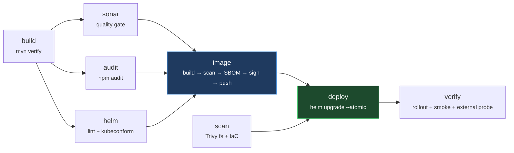

# Project 4 — Node.js App CI/CD on Azure AKS

**Author: Sanjay Naidu** · Platform Engineering portfolio project

End-to-end delivery pipeline for a Node.js (Express) REST API on Azure Kubernetes Service. Built on a free-trial budget, with the build driven through **Maven** — because plenty of real shops standardise on one build tool across a polyglot estate, and "the Node service builds with `mvn verify` like everything else" is a constraint worth knowing how to satisfy.

```
Node.js (Express) · Maven · Docker · Terraform · GitHub Actions (OIDC) · SonarCloud · Trivy · CodeQL · ACR · AKS · Helm
```


---

## Architecture


**Pipeline flow on every merge to `main`:**



---

## Why each decision (the part interviewers ask about)

### Application

| Decision | Why |
|---|---|
| **Express + a deliberately small domain** | The app is not the point. Keeping it small means every line of the *pipeline* is readable, and nothing hides behind framework magic. |
| **Three probes: `/healthz/startup`, `/ready`, `/live`** | They answer three different questions with three different consequences. A liveness probe that checks a dependency restarts every pod at once when that dependency wobbles — turning a degradation into an outage. Liveness here only asks "is this process still a working HTTP server?". |
| **Startup probe gating the other two** | Without it, liveness needs an `initialDelaySeconds` covering worst-case boot, and that delay then applies for the pod's whole life — so a hang ten hours later goes undetected for just as long. |
| **Drain window on `SIGTERM`** | Endpoint removal and `SIGTERM` happen *in parallel*, with no ordering guarantee. A process that exits promptly stops listening while proxies still route to it. Readiness flips to 503, the app keeps serving for 8s, *then* closes the listener. |
| **Metrics labelled on the matched route** | `/api/v1/orders/:id` is one time series. Labelling on the raw URL would mint a new series per order id and take Prometheus down — the classic cardinality explosion. There's a test asserting the id never appears in `/metrics`. |
| **Config validated at boot, fails fast** | A typo'd env var kills the process with a message naming the variable, instead of surfacing as a confusing 500 an hour later. |

### Build (why Maven for a JavaScript app)

| Decision | Why |
|---|---|
| **`frontend-maven-plugin`** | Maven doesn't build JavaScript. The plugin provisions a project-local Node/npm toolchain and binds npm scripts onto Maven phases, so `mvn verify` genuinely runs `npm ci` → ESLint → Jest with coverage. Nothing but a JDK is needed on the agent. |
| **Honest about the trade-off** | Greenfield with no constraint I'd use npm directly with `sonar-scanner-cli`. This pattern earns its keep in shops standardised on Maven: one build command, one artifact repo, one Sonar integration across every language. |
| **`npm ci`, never `npm install`** | Fails loudly when `package.json` and the lockfile have drifted, instead of quietly resolving versions nobody reviewed. |
| **Coverage floor at 90/80/90/90** | A ratchet just under actual (97%), not an aspirational number everyone learns to bypass. |

### Containerisation

| Decision | Why |
|---|---|
| **Multi-stage build** | Dev dependencies and the build cache never reach the published image. |
| **npm deleted from the runtime image** | This one came out of a *failing* pipeline: Trivy blocked the image on 24 HIGH + 2 CRITICAL findings, and every single one was inside npm's own bundled dependencies (`sigstore`, `glob`, `minimatch`, `cross-spawn`). The entrypoint is `node`; a package manager is dead weight. Removing it took the image to **zero findings**, and a guard fails the build if a future base image sneaks it back. |
| **Non-root, read-only root FS, all caps dropped** | Files stay root-owned while the process runs as `node`, so the container can't rewrite its own code. Only `/tmp` is writable, as a 64Mi in-memory volume. |
| **`--ignore-scripts` on install** | The cheapest defence against a compromised transitive package running arbitrary install hooks. |

### Infrastructure (Terraform)

| Decision | Why |
|---|---|
| **Remote state in Azure Storage, Entra ID auth** | `use_azuread_auth` with shared key access disabled on the account — there is no storage key to leak or rotate, only a role assignment. |
| **Resource group consumed as a `data` source** | It's created out of band, so `terraform destroy` removes the workload without touching the container it lives in — and the same code works on a locked-down subscription where you can't create resource groups. |
| **AKS Free tier control plane** | $0 vs ~$73/month for Standard, which only adds an uptime SLA a demo doesn't need. |
| **`Standard_D2as_v7` nodes, 2 × 2 vCPU** | Same trap as Project 3: burstable B-series isn't permitted on this subscription at all. `az vm list-usage` cheerfully reports "Standard BS Family vCPUs: limit 4" while AKS rejects the create outright — **quota and SKU permission are separate checks**. D2as_v7 is the cheapest permitted family (verified via the Azure Retail Prices API). |
| **Regional vCPU quota of 4 drives everything** | Two nodes is the ceiling, so the autoscaler is pinned min=max=2 and automatic upgrades are off — an upgrade surges a third node and would fail. Documented rather than left to break mysteriously. |
| **Azure CNI Overlay** | Pods draw from an overlay CIDR, so the `/24` node subnet never caps the cluster. |
| **`local_account_disabled` + Azure RBAC** | Kills the static cluster-admin kubeconfig entirely. Every `kubectl` call is an auditable Entra ID identity — which is what makes the role assignments meaningful rather than decorative. The operational cost is that CI now needs `kubelogin`. |
| **Log Analytics capped at 0.2 GB/day** | The most likely way to lose a trial credit isn't the cluster — it's a crash-looping pod writing to stdout overnight at ~$2.76/GB. The cap makes the worst case bounded. |

### CI/CD (GitHub Actions)

| Decision | Why |
|---|---|
| **OIDC federation, zero stored secrets** | No client secret exists. The detail that proves it's real: a job declaring `environment: dev` emits a *different* OIDC subject than a branch push, so it needs its own federated credential — six of them here. Get that wrong and the deploy job fails auth while the build job on the same commit succeeds. |
| **`Contributor` is not enough for Terraform** | It explicitly can't create role assignments, and this stack creates four. The CI principal also holds `Role Based Access Control Administrator`, scoped to the one resource group. |
| **Trivy scans the image *before* push** | Built with `load: true` and scanned in the local daemon, so a vulnerable artifact never reaches the registry — as opposed to scanning after push, when it's already pullable. |
| **Blocking vs advisory gates** | Image CVEs, committed secrets, tests, lint and the Sonar gate block. IaC misconfiguration is advisory, because findings like "ACR should have a private endpoint" are documented cost trade-offs, and blocking on those teaches everyone to bypass the scanner. |
| **Immutable `sha` image tags, enforced in the chart** | The Helm helper calls `fail` if the tag is empty or `latest`. Catching that at template time is free; discovering at 3am that two pods run different code is not. |
| **`plan` and `apply` as separate jobs** | Not cosmetic — declaring `environment:` changes the OIDC subject, so a single job that conditionally sets one would need credentials for both shapes. |
| **`helm --atomic` + smoke test + external probe** | A failed rollout auto-reverts. Then `helm test` proves in-cluster routing, and a curl against the public IP proves the whole path through the Azure LB. Deployment isn't done until it's verified. |
| **Teardown is a first-class workflow** | Guarded by a typed `DESTROY` confirmation and a protected environment. On a fixed credit, making teardown as easy as deployment *is* the cost control. |

### Helm chart (production traits)

- **`maxUnavailable: 0` with `maxSurge: 1`** → capacity never dips during a deploy. Paired with the app's drain window, that's what makes it genuinely zero-downtime.
- **`minReadySeconds: 10`** so a pod that passes one check then crashes can't let the rollout advance.
- **HPA (3→6) and a PodDisruptionBudget** using `maxUnavailable`, not `minAvailable` — the latter deadlocks node drains when the HPA sits at its floor.
- **Memory limit but no CPU limit.** CFS quota throttling on a single-threaded event loop causes worse p99 latency than the noisy-neighbour problem the limit would solve. Memory is incompressible, so that one is capped.
- **Config checksum annotation** → ConfigMap edits roll the pods automatically.
- **Hardened securityContext**: non-root, read-only root FS, all capabilities dropped, seccomp `RuntimeDefault`, `automountServiceAccountToken: false`.
- **NetworkPolicy** where the egress half does the real work: DNS and outbound 443 only, with `169.254.0.0/16` excluded to block the Instance Metadata Service — the standard container-escape-to-cloud-credentials path.

---

## Repository layout

```
├── app/                        # Express service, tests, Dockerfile, pom.xml
│   ├── src/                    # routes, middleware, lifecycle state machine
│   └── tests/                  # Jest suites incl. drain behaviour
├── deploy/helm/orders-api/     # chart + values-dev / values-prod
├── infra/terraform/            # AKS, ACR, VNet/NSG, Log Analytics, RBAC
│   └── environments/           # dev.tfvars / prod.tfvars
├── .github/workflows/          # ci, cd, infra, infra-destroy, platform, codeql
├── scripts/                    # OIDC setup, zero-downtime verification
└── docs/                       # setup, architecture, runbook, cost, interview notes
```

---

## Getting started

Full bootstrap — Azure app registration, OIDC federated credentials, state storage, GitHub variables, SonarCloud — lives in **[docs/AZURE-SETUP.md](docs/AZURE-SETUP.md)**.

Run locally (no Azure account needed):

```bash
cd app
npm install
npm test                  # Jest, 55 tests
npm run lint              # ESLint
mvn verify                # the exact build CI runs
docker build -t orders-api:local .

make helm-lint            # lint both value overlays
make tf-validate          # validate Terraform without a backend
make ci-local             # every gate that doesn't need Azure
```

Prove the zero-downtime claim against a live cluster:

```bash
./scripts/zero-downtime-check.sh    # hammers the endpoint through a rolling restart
```

---

## Production-hardening roadmap (what I'd add with a real budget)

1. **Separate system and user node pools**, non-burstable SKUs across three availability zones.
2. **Private cluster** with API server IP restrictions — needs self-hosted runners, since GitHub-hosted egress IPs rotate.
3. **ACR Premium** with a private endpoint, geo-replication and image retention.
4. **Progressive delivery** — Argo Rollouts or Flagger for canary with automatic metric-based abort.
5. **Namespace-scoped CI RBAC** (`RBAC Writer`) instead of cluster admin; the trade-off is documented in the runbook.
6. **Key Vault + CSI driver** for real secrets, consumed via the workload identity already enabled on the cluster.
7. **Alerting on the metrics that already exist** — SLOs and error budgets, plus `kube-audit` logs once ingestion isn't the binding cost constraint.

---

## Documentation

| Document | Contents |
|---|---|
| [AZURE-SETUP.md](docs/AZURE-SETUP.md) | manual prerequisites, OIDC, every repository variable |
| [ARCHITECTURE.md](docs/ARCHITECTURE.md) | the design decisions above, in depth |
| [RUNBOOK.md](docs/RUNBOOK.md) | rollback, debugging, scaling, proving zero-downtime |
| [COST.md](docs/COST.md) | cost model, stop/destroy levers, teardown checklist |
| [INTERVIEW-NOTES.md](docs/INTERVIEW-NOTES.md) | talking points and the questions this design invites |

---

*Built by **Sanjay Naidu** — platform engineer. Every decision above is one I can defend on a whiteboard, including the ones I'd do differently with a real budget.*
