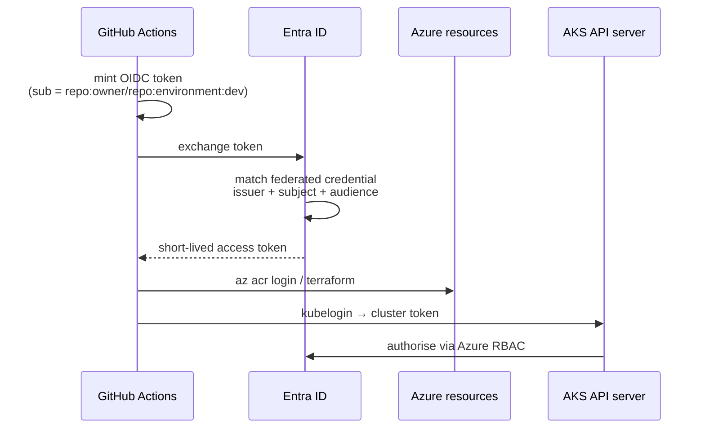
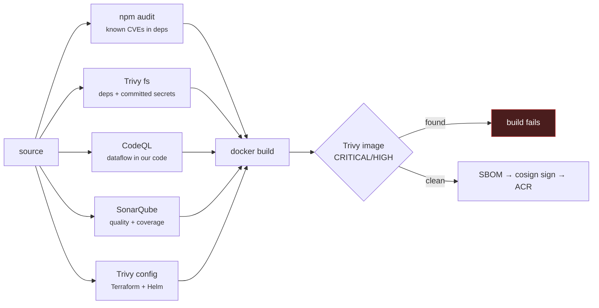

# Architecture

The reasoning behind the design. Each section covers a place where the obvious choice is subtly wrong.

---

## 1. The three-probe health model

Kubernetes gives you three probes. They are not three flavours of the same check — they answer three different questions and have three different consequences.

| Probe | Question | Consequence of failure |
|---|---|---|
| `startupProbe` | Has the process finished booting? | The other two probes are suspended until it passes |
| `readinessProbe` | Should traffic go here *right now*? | Pod removed from Service endpoints |
| `livenessProbe` | Is the process irrecoverably stuck? | **Container killed and restarted** |

### Why liveness must not check dependencies

The most common production incident in this area: a liveness probe that verifies the database connection. The database has a slow minute; every pod's liveness probe fails simultaneously; Kubernetes restarts every pod at once; the service is now completely down instead of degraded, and the restart storm adds load to the recovering database.

Here, `/healthz/live` returns 200 for the entire process lifetime. It only fails if the HTTP server itself has stopped functioning — which, given Node's single-threaded model, is the only condition a restart can actually fix.

Dependency health belongs in readiness (traffic diverts, pods survive) or in monitoring (a human is told).

### Why the startup probe earns its place

Without it you must set `initialDelaySeconds` on liveness to cover the *worst-case* boot time. That delay applies for the pod's entire life, so a process that hangs after ten hours goes undetected for the length of that delay.

The startup probe decouples them:

```
startupProbe:  failureThreshold 30 × periodSeconds 2  = up to 60s to boot
livenessProbe: failureThreshold  3 × periodSeconds 10 = ~30s to detect a hang
```

A slow start is tolerated; a hang is caught quickly. You cannot have both with two probes.

---

## 2. Zero-downtime rolling updates

`maxUnavailable: 0` alone does not give you zero downtime. It is necessary, not sufficient.

### The race nobody expects

When a pod is deleted, two things happen **in parallel**:

1. The endpoints controller removes the pod from Service endpoints, which then propagates to kube-proxy on every node and to the NGINX controller's own endpoint cache.
2. The kubelet sends `SIGTERM` to the container.

There is no ordering guarantee. A well-behaved process that exits promptly on `SIGTERM` will therefore stop listening while proxies are still routing to it — producing connection-refused errors for a second or two per pod, on every deploy.

### The fix, in `src/index.js`

```
SIGTERM received
  ↓
readiness flips to 503          ← endpoints removal begins
  ↓
sleep(SHUTDOWN_DRAIN_MS = 8s)   ← still accepting and serving requests
  ↓
server.close()                  ← stop accepting, finish in-flight
  ↓
closeIdleConnections()          ← release idle keep-alives
  ↓
exit 0
```

The drain window is the whole trick: the process deliberately stays alive and useful *after* being told to stop, long enough for every proxy to notice it is unready.

`terminationGracePeriodSeconds: 45` must exceed the drain plus close time, or the kubelet sends `SIGKILL` mid-drain and undoes the effort.

### The supporting settings

| Setting | Value | Reason |
|---|---|---|
| `maxSurge` | 1 | Must be non-zero — with both surge and unavailable at 0 the rollout deadlocks |
| `maxUnavailable` | 0 | Capacity never dips below `replicaCount` |
| `minReadySeconds` | 10 | A pod that passes one readiness check then crashes must not let the rollout advance |
| `progressDeadlineSeconds` | 300 | What `helm --atomic` uses to decide the rollout has failed |
| `keepAliveTimeout` | 65s | Must exceed the LB idle timeout, or the proxy reuses a socket the server is closing → sporadic 502s |

---

## 3. Resources: memory limit, no CPU limit

```yaml
requests: { cpu: 50m, memory: 128Mi }
limits:   { memory: 256Mi }
```

**CPU limits are enforced by CFS quota**: the kernel gives the container a slice of each 100ms period and then *stops scheduling it* until the next one. For a Node.js process — one thread running an event loop — that manifests as multi-hundred-millisecond stalls in p99 latency, even when average utilisation is well under the limit. The noisy-neighbour problem a CPU limit prevents is real but far less damaging than the throttling it causes. The CPU *request* still guarantees a scheduling share.

**Memory is different.** It is incompressible: a process cannot be asked to use less, only killed. Without a limit a leak grows until the node runs out and the kernel OOM-killer starts evicting *other* pods. The limit converts a cluster-wide incident into a single-pod restart.

The HPA needs the CPU **request** (utilisation is a percentage of request, not limit), which is why the request is set even though the limit is not.

---

## 4. Identity: no secrets anywhere



There is no client secret, no `AZURE_CREDENTIALS` JSON, no registry password, and no static kubeconfig. Nothing to rotate; nothing to leak; a compromised repository grants access only for the lifetime of one workflow run, and only under the exact trigger the federated credential names.

Three separate identities, each with the minimum it needs:

| Identity | Holds | Can do |
|---|---|---|
| CI service principal | nothing (federated) | manage the RG, push to ACR, admin one AKS cluster |
| AKS kubelet identity | managed identity | `AcrPull` on one registry |
| AKS cluster identity | managed identity | `Network Contributor` on one VNet |

### Cluster authorisation

`local_account_disabled = true` removes the static cluster-admin certificate that `az aks get-credentials --admin` would hand out. Combined with `azure_rbac_enabled = true`, Kubernetes authorisation is driven by Azure role assignments, so cluster access is granted, audited and revoked in the same place as everything else.

---

## 5. Supply chain



### Which gates block, and why the difference

**Blocking:** the image vulnerability scan, committed secrets, the Sonar quality gate, `npm audit`, tests and lint.

**Advisory (reported to the Security tab):** Trivy IaC misconfiguration and the filesystem scan.

The distinction is whether a finding is unambiguous. A HIGH CVE in a shipped image is never acceptable. An IaC rule like "ACR should have a private endpoint" is a genuine, documented trade-off here (Basic SKU does not support it) — blocking every push on it would train everyone to bypass the scanner, which is worse than not having it.

`.trivyignore` requires a reason and an expiry date for every suppression. An undated suppression is indistinguishable from ignoring the scanner.

### Scan before push, not after

The image is built with `load: true`, scanned in the runner's local daemon, and only then pushed. Scanning after push means a vulnerable image is already in the registry and already pullable.

### Immutable tags

`image.tag` is the git short SHA. The Helm helper calls `fail` if the tag is empty or `latest`:

```
{{- if or (eq $tag "") (eq $tag "latest") -}}
{{- fail "image.tag must be set to an immutable tag (the git SHA)." -}}
{{- end -}}
```

Catching that at template time costs nothing. Discovering at 3am that two pods in one ReplicaSet are running different code because `latest` moved between pulls costs a great deal.

---

## 6. Network design

```
VNet 10.20.0.0/16
└── snet-aks-nodes 10.20.1.0/24   ← nodes only
    └── NSG: VNet + AzureLoadBalancer inbound, deny all else

Pod overlay   10.244.0.0/16       ← not routable in the VNet
Service CIDR  10.0.0.0/16
```

**Azure CNI Overlay** rather than standard CNI: pods draw from an overlay CIDR instead of consuming real VNet addresses. With standard CNI, that `/24` node subnet would cap the whole cluster at ~250 pods including all system pods. Overlay makes the node subnet a function of node count only.

**NetworkPolicy** is enforced (`network_policy = "azure"` in the cluster, without which policy objects are silently inert — worse than having none, because the manifest suggests protection that does not exist).

The policy's value is asymmetric:

- **Ingress** is permissive on the app port. It has to be: Azure Load Balancer traffic arrives with a source address outside every cluster CIDR, and kubelet probes come from node IPs — neither is expressible with a pod or namespace selector. What it *does* enforce is that no other port on these pods is reachable at all.
- **Egress** is where the real restriction lives: DNS to `kube-system`, outbound TCP/443, and nothing else. `169.254.0.0/16` is explicitly excluded, which blocks the Azure Instance Metadata Service — the standard path from container escape to stolen cloud credentials.

In `values-prod.yaml` the Service is `ClusterIP`, so `allowExternalLoadBalancer` is false and the ingress rule becomes genuinely restrictive.

---

## 7. Why Maven builds a Node.js app

Maven does not build JavaScript. `frontend-maven-plugin` provisions a project-local Node/npm toolchain and binds npm scripts onto Maven's lifecycle phases:

| Phase | Runs |
|---|---|
| `initialize` | install Node + npm, `npm ci` |
| `process-sources` | `npm run lint` |
| `test` | `npm run test:coverage` → `coverage/lcov.info` |
| `sonar:sonar` | upload sources and coverage |

This is a real pattern, not a contrivance: organisations standardised on Maven get one build command, one artifact repository, one Sonar integration and one CI template across a polyglot estate. The cost is an extra JVM and a Node download per build; the benefit is that a Java developer can build the service without learning the npm ecosystem.

`npm ci` rather than `npm install` — it fails loudly when `package.json` and the lockfile have drifted, instead of silently resolving versions nobody reviewed.

The dev-loop escape hatch is still there: `npm test` and `npm run lint` work directly, and the `skip-npm` profile lets the Sonar job reuse the coverage report instead of re-running the suite.

---

## 8. Container hardening

| Control | Effect |
|---|---|
| Multi-stage build | npm, dev dependencies and the build cache never reach the runtime image |
| `npm ci --ignore-scripts` | a compromised transitive package cannot execute install hooks |
| Files owned by root, process runs as `node` | the container cannot rewrite its own code |
| `runAsNonRoot`, uid 1000 | rejected at admission if the image somehow defaults to root |
| `readOnlyRootFilesystem` | only `/tmp` is writable, and it is a 64Mi in-memory `emptyDir` |
| `drop: [ALL]` | no `CAP_NET_RAW`, no `CAP_CHOWN` — nothing to escalate with |
| `allowPrivilegeEscalation: false` | blocks setuid escalation |
| `seccompProfile: RuntimeDefault` | restricts the syscall surface |
| `automountServiceAccountToken: false` | the most useful post-escape artefact is simply absent |
| `apk upgrade` at build | closes base-layer CVEs, which is most of what Trivy would report |
| `tini` as PID 1 | reaps zombies and forwards signals correctly |

---

## 9. Observability

**Logs** — structured JSON on stdout via pino, with pod/node/version/gitSha on every line and authorization headers redacted. Container Insights collects them; the daily ingestion cap is the guard against a crash loop turning into a bill.

**Metrics** — Prometheus on `/metrics`: default process metrics, an HTTP latency histogram, a request counter, and an application gauge.

The histogram labels on the *matched route*, not the URL:

```js
const route = req.route ? `${req.baseUrl}${req.route.path}` : 'unmatched';
```

`/api/v1/orders/:id` is one time series. Labelling on `req.path` would mint a new series per order id and take down Prometheus — the classic cardinality explosion. There is a test asserting the id does not appear in the metrics output.

**Correlation** — an `x-request-id` is accepted from the edge or generated, echoed on the response, and attached to every log line, so a user-reported failure maps to exact log entries.

---

## 10. Cost as a design constraint

Not an afterthought — it changed real decisions:

| Decision | Alternative | Saving |
|---|---|---|
| AKS Free tier | Standard (SLA) | ~$73/mo |
| `Standard_D2as_v7` | `Standard_D2s_v7` | ~$60/mo |
| ACR Basic | Premium | ~$45/mo |
| Log Analytics 0.2 GB/day cap | uncapped | unbounded |
| One-click destroy workflow | manual cleanup | the entire remaining credit |

The daily ingestion cap deserves emphasis. On a fixed trial credit, the most likely way to lose the subscription is not the cluster — it is a crash-looping pod writing to stdout and ingesting gigabytes overnight. The cap makes the worst case bounded.

The teardown workflow is a cost control, not a convenience. Making destruction as easy as deployment is what stops an idle cluster billing for three weeks.
